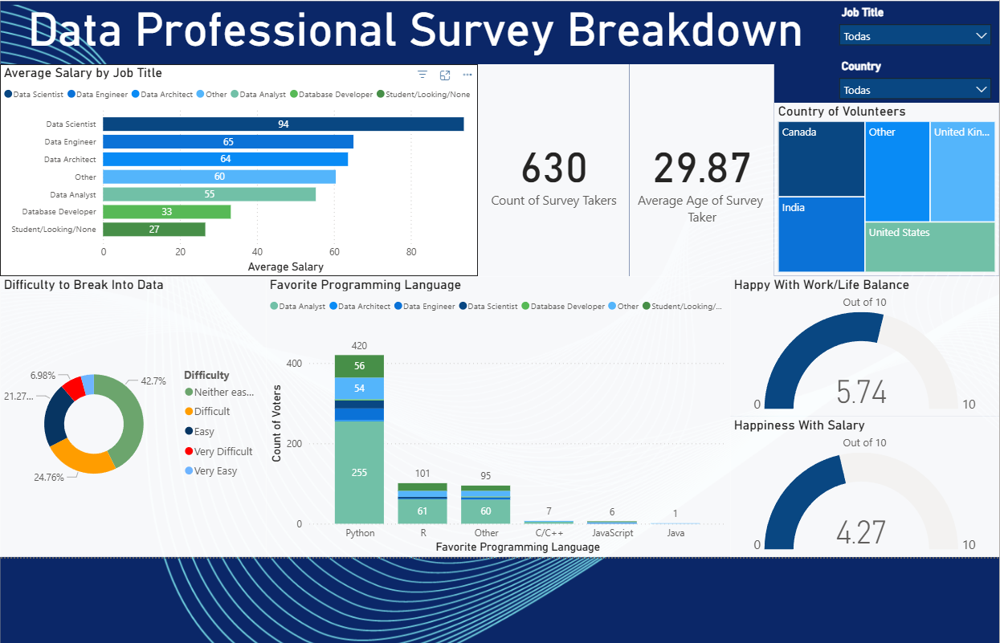

# 📊 Data Professional Survey — Power BI Dashboard

> End-to-end Business Intelligence project analyzing the career satisfaction, compensation, and programming preferences of **630 data professionals** across multiple countries.

---

## 🎯 Objective

This project was built to answer real business questions about the data industry:

- What does **compensation look like** across different data roles and countries?
- Which **programming languages** dominate each role?
- How satisfied are professionals with their **salary and work-life balance**?
- How **hard is it to break into** the data field?

---

## 📈 Key Findings

| Metric | Result |
|---|---|
| Survey respondents | 630 professionals |
| Average age | 29.87 years |
| Highest-paying role | Data Scientist — avg. **$94K/year** |
| Most popular language | **Python** — 420 votes |
| Work-life balance score | **5.74 / 10** |
| Salary satisfaction score | **4.27 / 10** |
| Neutral on industry entry difficulty | 42.7% said "Neither Easy nor Hard" |

---

## 🔧 Development Process

### 1. Data Cleaning — Power Query (M)
- Removed duplicate entries and irrelevant metadata columns
- Standardized inconsistent job titles and country names
- Parsed salary text ranges (e.g. `"50k–60k"`) into numeric midpoint values for aggregation
- Handled null and blank values across all survey fields

### 2. Data Modeling
- Built a clean, optimized model for DAX calculations
- Created calculated measures for all KPI cards (average salary, average age, satisfaction scores)
- Validated all dashboard outputs against raw source data

### 3. Dashboard Design
- **KPI Cards** — Total respondents and average age at a glance
- **Bar chart** — Average salary by job title
- **Stacked bar chart** — Favorite programming language broken down by data role
- **Treemap** — Geographic distribution of survey respondents
- **Donut chart** — Difficulty breaking into the data field (5 levels)
- **Gauge charts** — Work-life balance and salary satisfaction (out of 10)
- **Slicers** — Job Title and Country filters applied across all visuals simultaneously

---

## 📁 Project Files

| File | Description |
|---|---|
| `Power BI - Final Project.xlsx` | Raw source dataset (survey responses) |
| `Final Project Finished.pbix` | Power BI report — full interactive dashboard |

---

## 🛠️ Tools & Technologies

| Tool | Use |
|---|---|
| Power BI Desktop | Dashboard development and publishing |
| Power Query (M) | Data cleaning and transformation |
| DAX | Calculated measures and KPIs |
| Microsoft Excel | Source data format |

---

## 💡 How to Open

1. Download `Final Project Finished.pbix`
2. Open with [Power BI Desktop](https://powerbi.microsoft.com/desktop) (free)
3. Use the **Job Title** and **Country** slicers to filter all visuals interactively
4. Hover over any chart for detailed tooltips

---

## 👤 Author

**Eugenio Quintero** — Data Analyst & BI Developer

📧 qeugenios@gmail.com
